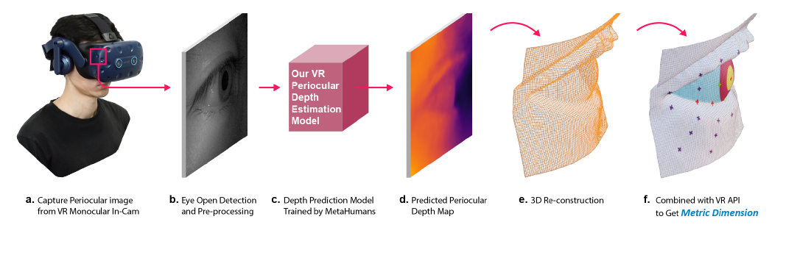

# DeepMetricEye

[中文](README.zh-CN.md) | English

[](LICENSE)
[](https://doi.org/10.1109/ISMAR59233.2023.00058)
[](https://arxiv.org/abs/2311.07235)
[](DPDG_Environment/)
[](DepthEstimationModel/)

Research code and data-generation tooling for **DeepMetricEye: Metric Depth Estimation in Periocular VR Imagery**.
The repository contains the Dynamic Periocular Data Generation (DPDG) environment and a periocular depth-estimation model for reconstructing metric eye-region geometry from monocular VR headset imagery.



## Why This Exists

Eye-oriented cameras in modern VR headsets can observe pupil and periocular features, but their 2D outputs are not enough for metric measurements such as pupil diameter, periocular deformation, or light-stimulus evaluation. DeepMetricEye bridges that gap with:

- a lightweight monocular depth-estimation model for periocular imagery,
- a UE MetaHuman-based synthetic data-generation environment,
- RGB/depth training pairs for rapid experimentation,
- a reproducible starting point for VR eye-health and XR sensing research.

## Repository Layout

| Path | Purpose |
| --- | --- |
| [`DPDG_Environment/`](DPDG_Environment/) | Unreal Engine 5.2 MetaHuman environment for synthetic periocular image and depth-map generation. |
| [`DepthEstimationModel/`](DepthEstimationModel/) | PyTorch/Jupyter implementation of the periocular depth-estimation model and a minimal sample dataset. |
| [`docs/data-access.md`](docs/data-access.md) | Public data notes, sensitive-data policy, and author contact for restricted raw scans. |
| [`CITATION.cff`](CITATION.cff) | Machine-readable citation metadata for GitHub, Zotero, and citation managers. |

## Quick Start

### Depth-Estimation Model

```bash
cd DepthEstimationModel
python -m venv .venv
source .venv/bin/activate
pip install torch torchvision pillow matplotlib scipy tqdm numpy
jupyter notebook model.ipynb
```

The included `train_data_minimal/` directory is a small RGB/depth sample for verifying the training and inference pipeline. It is not the full research dataset.

### DPDG Environment

1. Install Unreal Engine 5.2.
2. Download the DPDG package from the link documented in [`DPDG_Environment/README.md`](DPDG_Environment/README.md).
3. Open `HumanDataset.uproject`.
4. Configure MetaHuman identity, VR headset geometry, camera pose, lighting, and output directories.
5. Export synchronized periocular RGB images and ground-truth depth maps.

## Research Links

- Project page: <https://yitongsun.com/deepmetriceye>
- Paper DOI: <https://doi.org/10.1109/ISMAR59233.2023.00058>
- arXiv: <https://arxiv.org/abs/2311.07235>
- Code repository: <https://github.com/sunyitong/DeepMetricEye>

## Data Access

The full experimental data contains sensitive facial information and is not distributed directly through this repository. See [`docs/data-access.md`](docs/data-access.md) for the public sample dataset, restricted data policy, and contact process.

## Citation

If this repository helps your research, please cite the paper:

```bibtex
@inproceedings{Sun_2023,
  title={DeepMetricEye: Metric Depth Estimation in Periocular VR Imagery},
  DOI={10.1109/ISMAR59233.2023.00058},
  booktitle={2023 IEEE International Symposium on Mixed and Augmented Reality (ISMAR)},
  publisher={IEEE},
  author={Sun, Yitong and Zhou, Zijian and Diels, Cyriel and Asadipour, Ali},
  year={2023},
  pages={434--443}
}
```

## Contributing

Issues and pull requests are welcome, especially for reproducibility fixes, documentation improvements, dataset-loader cleanup, and additional VR headset calibration notes. Please read [`CONTRIBUTING.md`](CONTRIBUTING.md) before opening a larger change.

## License

This repository is released under the [GNU General Public License v3.0](LICENSE).
